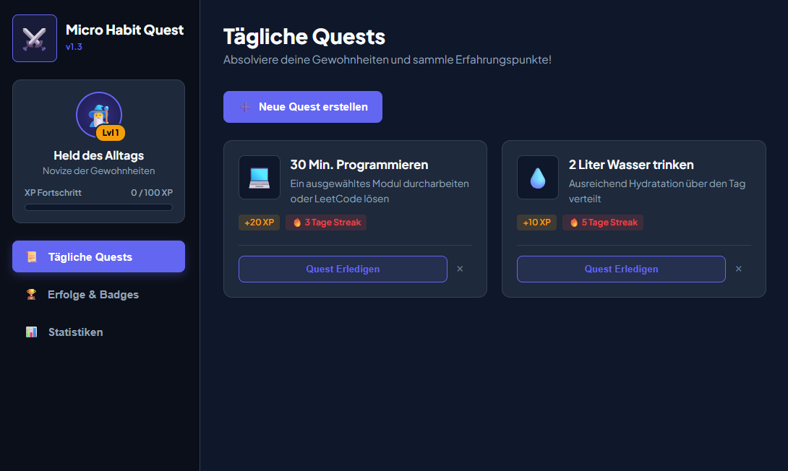

# Micro-Habit-Quest

ist eine gamifizierte Webanwendung zur Verfolgung täglicher Gewohnheiten. Diese Gewohnheiten sind auch als „Habits“ bekannt. Dieses Projekt kombiniert das Prinzip der „Selbst-Verbesserungs-Umgebung“ mit spielerischen Elementen (Gamification) aus Rollenspielen (RPGs). Nutzer: innen können Alltagsziele definieren zum Beispiel „30min Programmieren“ oder „2 Liter Wasser trinken“. Für jede erfolgreiche absolvierte Gewohnheit erhalten sie Erfahrungspunkte (XP), steigen im Nutzer-Level auf und schalten Erfolge (Badges) frei. Das System soll die Zielgruppe von Studierenden oder Berufstätigen ansprechen, die ihre tägliche Produktivität und Motivation durch Belohnungsanreize steigern möchten.

# How To / Anleitung

1. Erstelle ein Ordner mit dem Namen "Micro Habit Quest" und lege diesen am besten auf dem Desktop ab.
2. Downloade die "micro_habit_quest.html" Datei herunter und lege sie in diesen Ordner.
3. Downloade die "style.css" Datei herunter und lege sie in diesen Ordner.
4. Downloade die "app.js" Datei herunter und lege sie in diesen Ordner.
5. Öffne die Datei "micro_habit_quest.html" mit einen Browser (z.B. Google Chrome).

